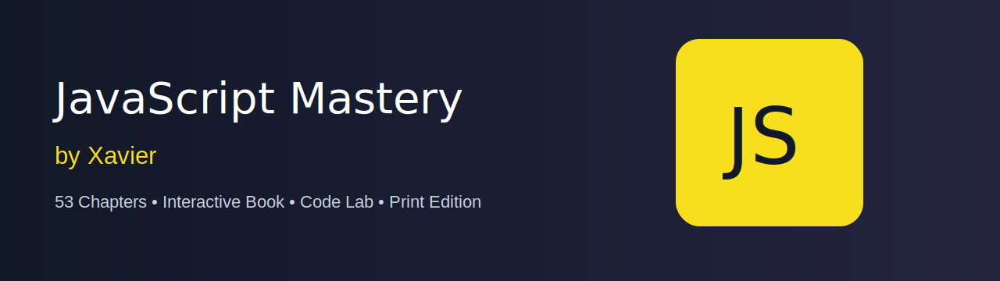

<p align="center">
  
</p>

# JavaScript Mastery by Xavier

A 53-chapter interactive JavaScript reading book created by **Mr Xavier**.

**Live book:** https://mrxavier53.github.io/JavaScript_Mastery_by_Mr-Xavier/

## Highlights

- 53 chapter files in `js/chapters/` — each readable and editable on GitHub
- Original long-form book lessons with diagrams and editor-style code examples
- Distraction-free **Read the Book** mode with cover page and table of contents
- Learn & Practice mode with in-page code challenges and quick checks
- Browser-based JavaScript **Code Lab**
- Reading progress, XP, badges, UI sounds, hover/click effects
- Print button with clean light-theme book print layout / Save as PDF
- JavaScript yellow icon, favicon, web-app manifest, and offline-friendly service worker

## Project structure

```text
assets/
  banner/               README banner
  diagrams/             one original SVG diagram per chapter
  icons/                JavaScript icon and favicon
  sounds/               original short interface sounds
css/
  styles.css
js/
  app.js
  chapter-index.js
  chapters/
    chapter-01-welcome-to-javascript.js
    ...
    chapter-53-where-to-go-next.js
```

## Open locally

Open `index.html` in a modern browser. For module loading and service worker support, use GitHub Pages or a small local static server.

## Ownership

Created by **Mr Xavier**. Keep credit and the project link when sharing modified versions.
